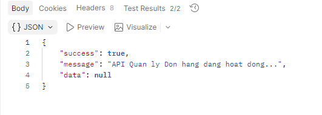
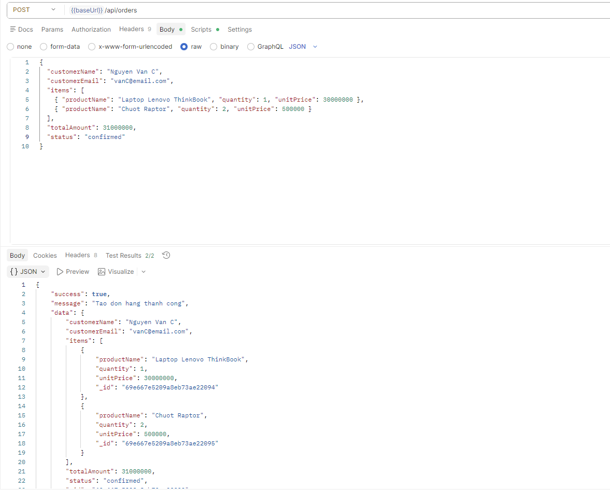
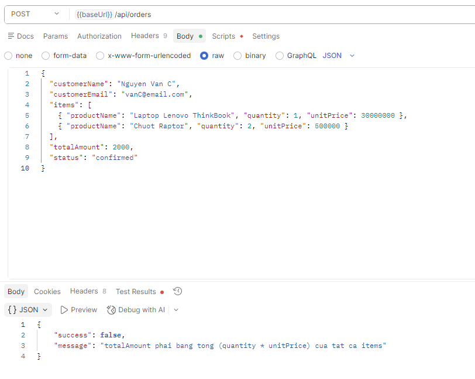
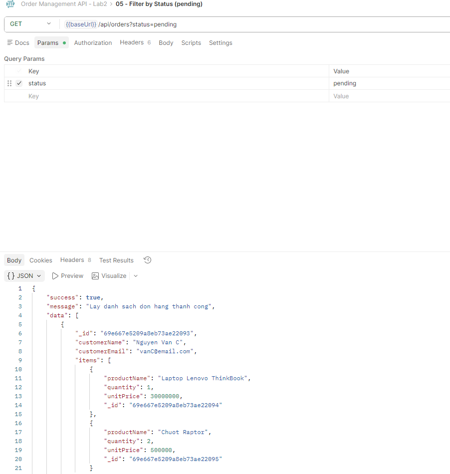
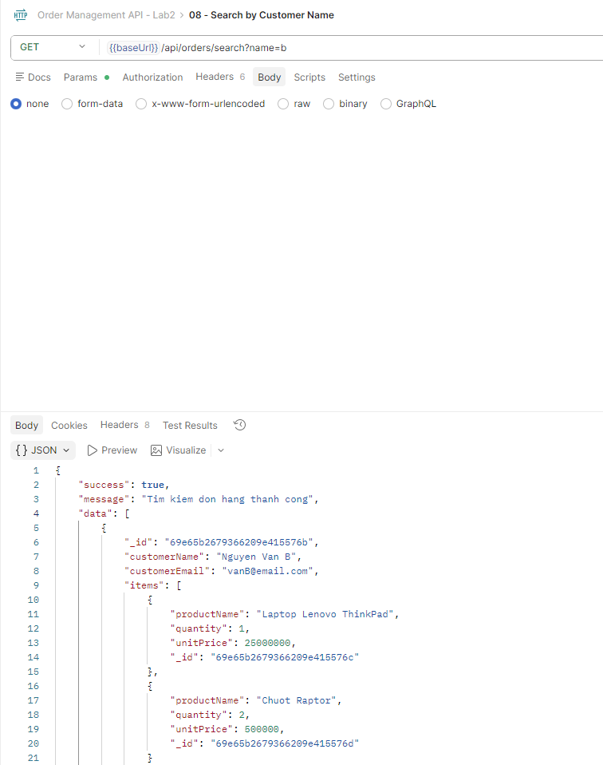
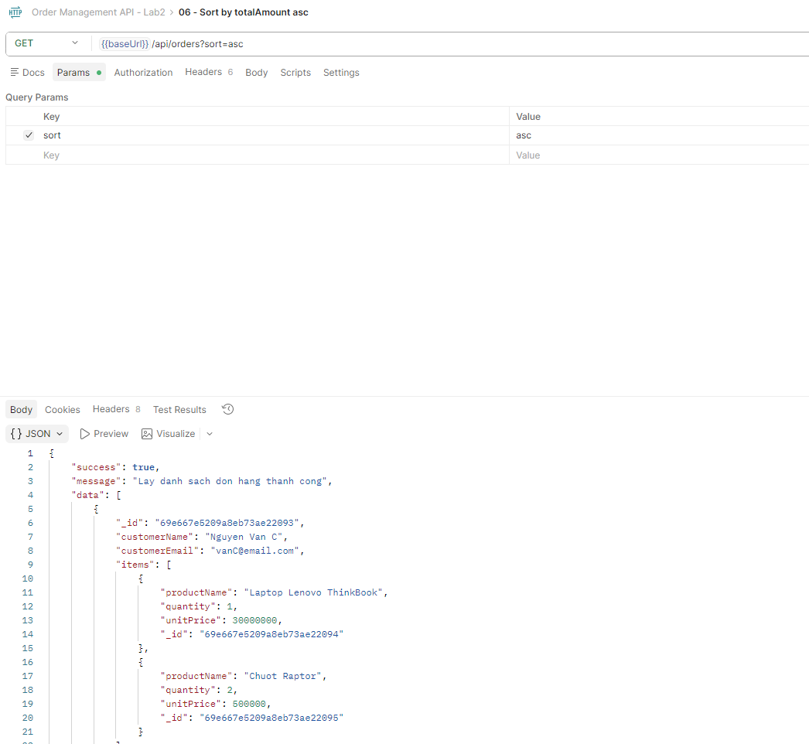
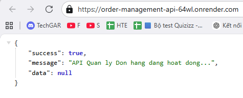

# Order Management API

RESTful API quản ly don hang (Orders) - Lab 2, Nhom 2  
Stack: Node.js, Express, MongoDB Atlas, Mongoose
## Muc Tieu

- Xay dung backend CRUD cho don hang.
- Ap dung validation nang cao: `totalAmount = sum(quantity * unitPrice)`.
- Chuan hoa response JSON theo mot format thong nhat.
- Ho tro loc, tim kiem, sap xep du lieu don hang.
- Trien khai backend len Render de test online.

## Link Demo Va Repo

- Demo Render: https://order-management-api-64wl.onrender.com
- Health check: https://order-management-api-64wl.onrender.com/
- Repository: https://github.com/danielnguyendbk/order-management-api

## Kien Truc

```text
Client (Postman / Frontend)
        |
        v
Express Server (server.js)
  - Middleware: cors, morgan, express.json
  - Route prefix: /api/orders
        |
        v
Order Routes (routes/orderRoutes.js)
  - CRUD + filter/search/sort
  - Validate totalAmount, ObjectId
        |
        v
Mongoose Model (models/Order.js)
        |
        v
MongoDB Atlas
```

## Huong Dan Setup Local

### 1) Clone va cai dependencies

```bash
git clone https://github.com/danielnguyendbk/order-management-api.git
cd order-management-api
npm install
```

### 2) Tao file env


```

Luu y:
- Neu gap `querySrv ECONNREFUSED`, giu bien `MONGO_DNS_SERVERS` nhu tren.
- Trong MongoDB Atlas, can mo IP Access List phu hop.

### 3) Chay server

```bash
npm run dev
# hoac
npm start
```

Base URL local: `http://localhost:5000`

## API Checklist

### Core CRUD

- [x] `GET /` - Health check
- [x] `GET /api/orders` - Lay tat ca don hang
- [x] `GET /api/orders/:id` - Lay don hang theo ID
- [x] `POST /api/orders` - Tao don hang moi
- [x] `PUT /api/orders/:id` - Cap nhat don hang
- [x] `DELETE /api/orders/:id` - Xoa don hang

### Mo Rong

- [x] `GET /api/orders?status=pending` - Loc theo trang thai
- [x] `GET /api/orders/search?name=...` - Tim kiem theo ten khach hang (regex, case-insensitive)
- [x] `GET /api/orders?sort=asc|desc` - Sap xep theo `totalAmount`
- [x] Validation `totalAmount`
- [x] Response chuan hoa: `{ success, message, data }`
- [x] Logging middleware bang `morgan`

## Mau Request

### Tao don hang

`POST /api/orders`

```json
{
  "customerName": "Nguyen Van A",
  "customerEmail": "vana@email.com",
  "items": [
    { "productName": "Laptop Dell XPS", "quantity": 1, "unitPrice": 25000000 },
    { "productName": "Chuot Logitech", "quantity": 2, "unitPrice": 500000 }
  ],
  "totalAmount": 26000000,
  "status": "pending"
}
```

## Huong Dan Test Postman

1. Import collection co san: `postman/order-management-api.postman_collection.json`.
2. Tao environment voi bien `baseUrl`:
   - Local: `http://localhost:5000`
   - Production: `https://order-management-api-64wl.onrender.com`
3. Chay lan luot cac request trong collection (01 -> 13).

## Anh Chup Ket Qua Test

Chen screenshot cua ban vao muc nay khi nop bai (goi y):

- Anh 1: Health check tra ve `success: true`

- Anh 2: Tao don hang thanh cong (201)

- Anh 3: Validation sai `totalAmount` (400)

- Anh 4: Filter theo `status=pending`

- Anh 5: Search theo `name=b`

- Anh 6: Sort theo `totalAmount`

- Anh 7: Deploy Render tra ve ket qua online


## Cac Thu Muc Chinh

- `server.js`: Khoi dong app, middleware, ket noi MongoDB, map routes.
- `models/Order.js`: Mongoose schema cua Order.
- `routes/orderRoutes.js`: CRUD + filter/search/sort + validation.
- `postman/order-management-api.postman_collection.json`: Collection de test nhanh.

## Deploy Render (Tom Tat)

1. Tao Web Service tu repo GitHub tren Render.
2. Build command: `npm install`.
3. Start command: `npm start`.
4. Environment variables:
   - `MONGO_URI`
   - `NODE_ENV=production`
   - `MONGO_DNS_SERVERS=8.8.8.8,1.1.1.1`
5. Truy cap URL production: https://order-management-api-64wl.onrender.com
